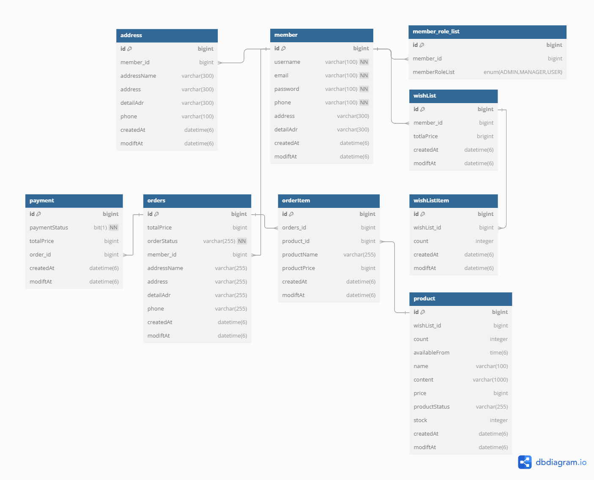

# 🛍 선착순 구매
**Spring boot** 기반의 **E-commerce 선착순 구매 시스템**입니다. 
**Redis와 Kafka** 를 활용해 **동시성 처리** 와 빠른 주문 처리를 구현하였으며, **캐싱을 통한 실시간 재고 관리** 기능을 제공합니다. 또한 **MSA(Microservices Architecture)**를 도입하여 각 서비스의 **확장과 유지보수성**을 향상시켰습니다. 
 
일반적인 상품 구매 기능과, 한정된 수량의 상품을 특정 시간에 오픈하여 선착순으로 구매할 수 있는 기능을 제공합니다.
 
- 개발 기간 : 2024.08.07 ~ 2024.09.04
-
<a href="https://documenter.getpostman.com/view/30578335/2sA3s3GqpS" target="_blank">API 명세서</a>
  

## Project Archictecture

 

## ERD

 

## Tech Stack
- IDE : IntelliJ IDEA Community
- Java : JDK 17
- Spring Boot / Spring Security ： 3.3.0
- JWT : 0.12.3
- Gradle : 7.3.2
- MySQL :  9.0.1
- Redis : 7.4.0
- Kafka : 2.8.1
- Docker : 27.0.3
- Discoverey service : Netflix Eureka
- API Gateway : Spring Cloud Gateway
- SMTP: Spring Boot Mail Starter
 

## Main Feature

## 버전
