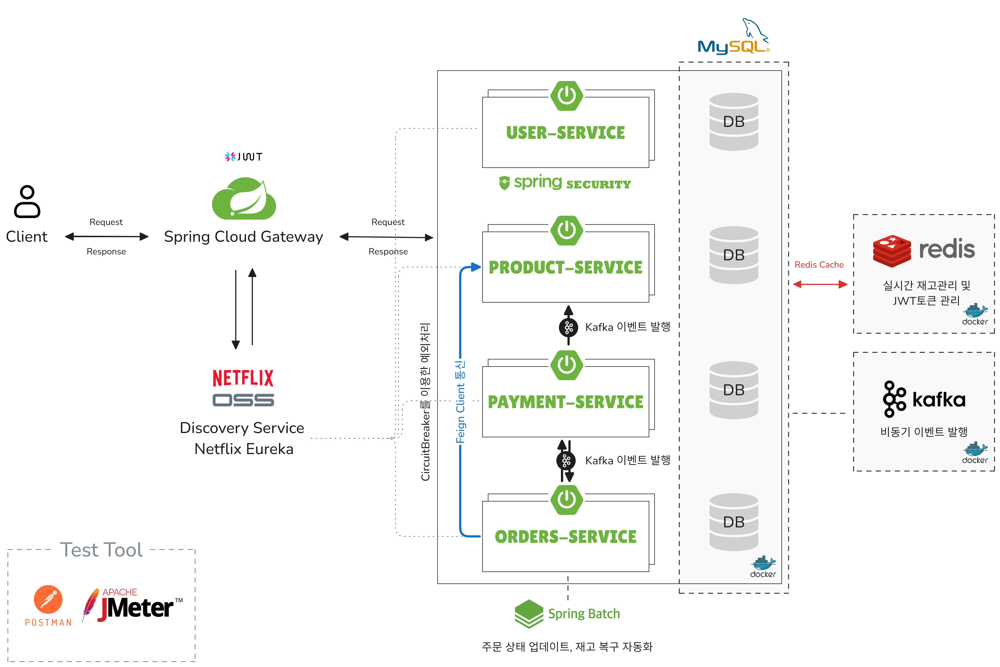

# 🛍 예약 구매 서비스
**대규모의 트래픽을 처리해 선착순 구매 기능을 지원**하는 E-commerce 서비스  
일반적인 상품 구매 기능과, 한정된 수량의 상품을 특정 시간에 오픈하여 선착순으로 예약 구매할 수 있는 기능을 제공  
- 개발 기간 : 2024.08.07 ~ 2024.09.06
- Docs [(바로가기)]()
- API 명세서 [(바로가기)](https://documenter.getpostman.com/view/30578335/2sA3s3GqpS)  
- 테스트 시나리오 [(바로가기)](https://documenter.getpostman.com/view/30578335/2sA3s3GqpS)  

## 목차
- [프로젝트 아키텍처](#프로젝트-아키텍처)
- [사용 기술](#사용기술)
- [구현 기능](#구현기능)
- [기술적 의사 결정](#기술적-의사-걀정)
- [트러블슈팅](#트러블슈팅)
  - 실시간 재고 캐싱 처리
  - kafka 메시징 처리
  - 동시성 문제 해결
  - 사용자 보안 강화
  - 마이크로소프트 간 장애 전파 방지
- [버전](#버전)  

 
## 프로젝트 아키텍처
### ERD 
  

### 서비스 아키텍처
  

## 사용기술
### IDE  
  

### 언어 / 프레임워크  
    

### 인증/인가  
    

### 데이터베이스  
 

### 메시징

### 컨테이너  
  

### 기타
   

## 구현기능

## 기술적 의사 결정

## 트러블슈팅

### 실시간 재고 캐싱 처리

### kafka 메시징 처리

### 동시성 문제 해결

### 사용자 보안 강화

### 마이크로소프트 간 장애 전파 방지

## 버전
### v11.15.7
2024.09.05
- [추가] kafka를 이용해 비동기 이벤트 처리로 전환
- [수정] 결제 로직 수정
- [수정] 코드 리팩토링

### v11.14.7
2024.09.03
- [수정] 결제 API 수정
- [수정] 동시성 문제 해결을 위한 DB재고 비관적 락 설정
- [추가] 테스트 시나리오 작성

### v11.13.6
2024.08.31
- [추가] 결제 테이블 추가
- [수정] 결제 로직및 재고 복구 로직 수정

### v10.13.6
2024.08.30
- [오류] Redis 분산락을 활용한 동시성 문제 해결
- [수정] Spring Batch를 이용해 주문 시간 제한및 수량 복구 업데이트
- [수정] 주문 로직 수정
- [추가] 선차순 구매를 위핸 상품구매 오픈시간 API작성

### v10.12.5
2024.08.29
- [수정] 코드 리팩토링
- [수정] Redis로 재고 캐싱 처리

### v10.11.5
2024.08.25
- [추가] 결제 api 작성

### v9.11.5
2024.08.23
- [수정] 주문로직 수정
- [추가] Circuit Breaker/ Retry 추가

### v9.10.5
2024.08.22
- [추가] resilience4j 추가

### v8.9.5
2024.08.21
- [추가] refreshToken redis에 추가 TTL
- [수정] accessToken 블랙리스트 설정

### v8.8.5
2024.08.21
- [추가] 배송 로직 추가
- [추가] order에 배송지 추가

### v8.7.5
2024.08.20
- [추가] FeignClient 서비스 통신

### v7.7.5
2024.08.19
- [추가] API gateway를 통한 사용자 인증 처리- JWT 토큰 검증

### v7.6.5
2024.08.18
- [추가] spring cloud gateway 구현
- [추가] API gateway를 Eureka와 연동

### v6.6.5
2024.08.16
- [추가] Netflix Eureka를 사용해서 Client-Side Discovery 구현

### v5.6.5
2024.08.16
- [변경] 멀티모듈 코드 리팩토링
- [변경] MSA(Microservices Architecture) 구조로 전환

### v4.5.5
2024.08.15
- [추가] 주문 상태 일괄 처리 및 자동화를 위한 Spring Batch를 추가

### v4.4.3
2024.08.14
- [추가] Order, OrderItem 테이블 작성
- [공통] 생성 시간 및 수정 시간 컬럼을 전체 테이블에 추가

### v3.4.3
2024.08.13
- [추가] 위시리스트 기능을 추가, 상품 추가/수량 변경 및 상품 삭제 API 작성
- [추가] AccessToken과 RefreshToken 발급 기능을 추가
- [추가] 로그아웃 API작성

### v2.4.3
2024.08.12
- [추가] 페이징 처리기능 추가
- [수정] 전체 상품 리스트에서 AVAILABLE 상태인 상품만 조회
- [수정] 배송지 기본 배송지 상태 컬럼 추가

### v2.3.3
2024.08.11
- [추가] 상품 테이블추가
- [추가] 전체 상품 리스트 및 상세 페이지 API 작성
- [수정] JWT 만료 시간 오류를 수정
- [추가] 배송지 테이블 추가

### v1.1.2
2024.08.10
- [추가] Spring Security를 사용한 회원가입 및 로그인 API 작성
- [추가] JWT 토큰 발급 기능을 추가
- [추가] 회원가입 시 이메일 인증을 위한 Google SMTP를 추가
- [수정] 개인정보, 이메일, 비밀번호를 암호화하여 저장
- [공통] API 유틸리티 클래스를 작성

### v0.0.1
2024.08.08
- [패치]: Docker 환경설정 추가
